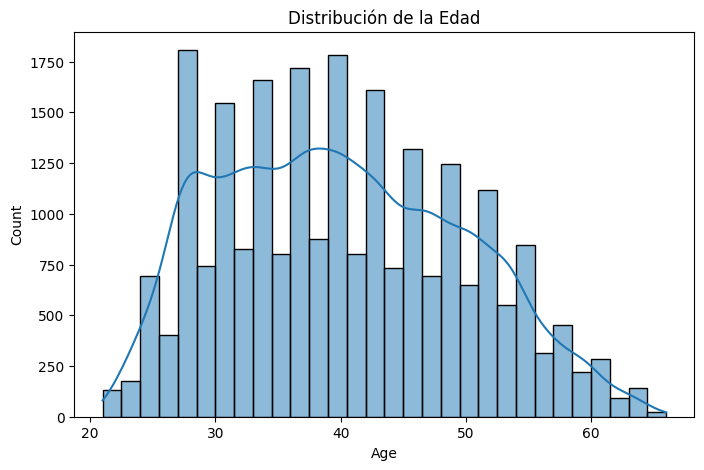
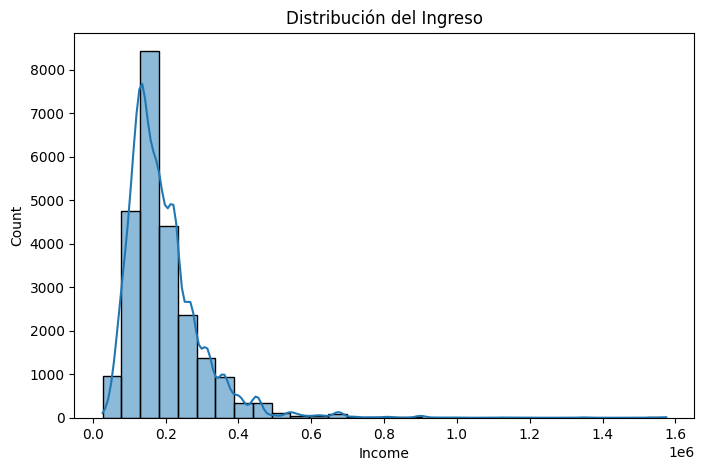
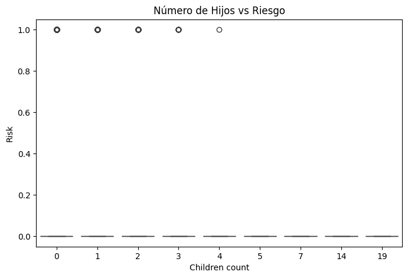
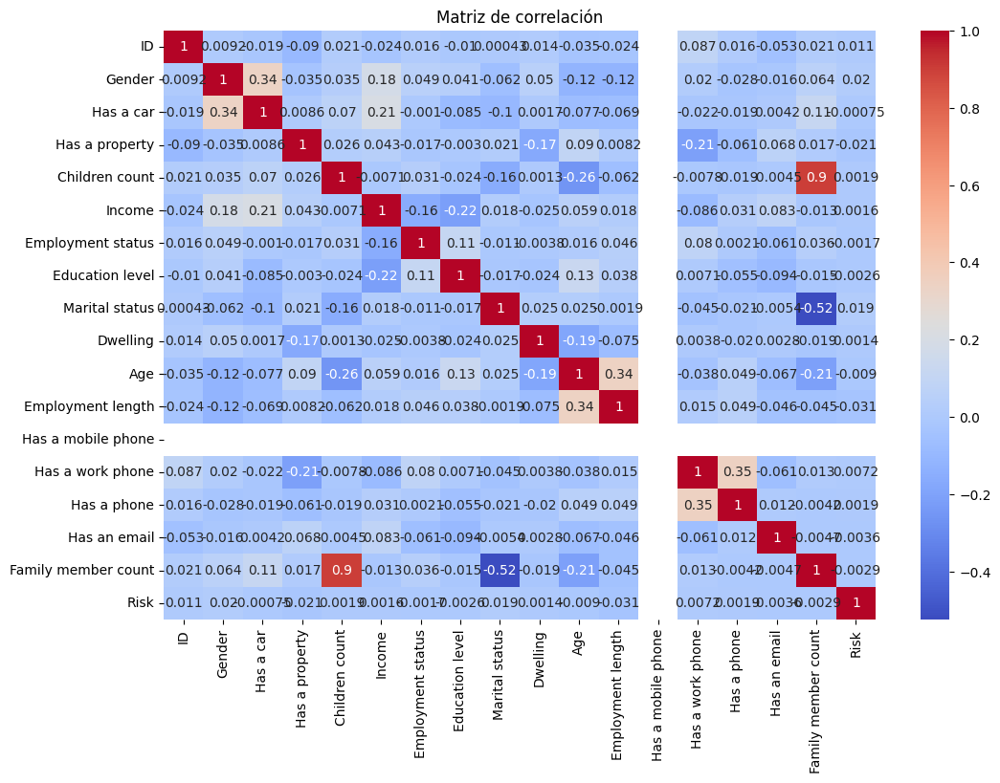
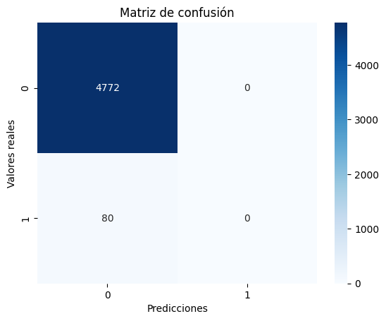
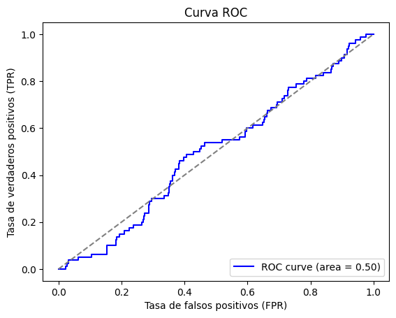

# Análisis de Riesgo Crediticio 📈

## 1. Introducción
En este proyecto, se desarrolla un modelo predictivo para evaluar el riesgo crediticio utilizando técnicas de aprendizaje automático. El objetivo es clasificar a los clientes en dos categorías: "alto riesgo" (1) y "bajo riesgo" (0).

## 2. Carga y Preparación de Datos
Primero, se cargan y preparan los datos del archivo `creditrisk.xlsx`. Las características disponibles incluyen:

- ID
- Gender
- Has a car
- Has a property
- Children count
- Income
- Employment status
- Education level
- Marital status
- Dwelling
- Age
- Employment length
- Has a mobile phone
- Has a work phone
- Has a phone
- Has an email
- Family member count
- Risk (variable objetivo)

## 3. Análisis Exploratorio de Datos (EDA) 🕵️‍♂️

Se realizaron análisis exploratorios para entender la distribución de las variables y su relación con la variable objetivo.

 
- Distribucion de edad de los clientes: 

- Distribución del Ingreso 

- Relación entre el Número de Hijos y el Riesgo Relación entre el Número de Hijos y el Riesgo 

- Matriz de Correlación 

## 4. Modelado

### 4.1. Regresión Logística
Se entrenó un modelo de regresión logística para clasificar el riesgo crediticio.

#### Resultados del Modelo
##### Matriz de Confusión

[[3932 840] [ 72 8]]

##### Reporte de Clasificación

          precision    recall  f1-score   support

       0       0.98      0.82      0.90      4772
       1       0.01      0.10      0.02        80

accuracy                           0.81      4852

macro avg 0.50 0.46 0.46 4852 weighted avg 0.97 0.81 0.88 4852

##### Métricas Clave

- **Precisión del Modelo**: 0.01
- **Curva ROC**: 0.50

#### Análisis de Resultados
El modelo presenta una alta precisión general del 81%, pero la efectividad en la identificación de casos de riesgo (Clase 1) es insuficiente. Aquí hay algunos puntos clave a considerar:

1. **Desbalance de Clases**: A pesar de los esfuerzos por ajustar pesos y aplicar técnicas de validación cruzada, el desbalance en la distribución de las clases sigue siendo un reto significativo. La clase "alto riesgo" tiene muy pocos ejemplos, lo que dificulta que el modelo aprenda a identificar correctamente estos casos.

2. **Implicaciones**: La baja capacidad para predecir correctamente los casos de riesgo sugiere que es esencial explorar métodos adicionales para mejorar la detección y gestión del riesgo. Solo se identificaron correctamente 8 de los 80 casos de riesgo, lo que tiene implicaciones serias en la toma de decisiones financieras.

3. **Oportunidades de Mejora**: Aunque se aplicaron técnicas como SMOTE para abordar el desbalance, es posible que se requieran enfoques adicionales, como el uso de algoritmos más avanzados, la recolección de más datos de la clase minoritaria, o incluso técnicas de sobremuestreo y submuestreo para abordar el desbalance de clases de manera más efectiva.

### 4.2. Random Forest
Se desarrolló un modelo de Random Forest para mejorar la clasificación del riesgo crediticio.

#### Resultados del Modelo
##### Matriz de Confusión
[[4727 43] [ 69 13]]

##### Reporte de Clasificación

          precision    recall  f1-score   support

       0       0.99      0.99      0.99      4770
       1       0.23      0.16      0.19        82

accuracy                           0.98      4852

macro avg 0.61 0.57 0.59 4852 weighted avg 0.97 0.98 0.97 4852

##### Métricas Clave

- **Precisión del Modelo**: 0.23
- **Curva ROC**: 0.61

#### Análisis de Resultados
El modelo de Random Forest muestra una precisión general alta del 98%, pero aún enfrenta desafíos en la identificación de la clase de alto riesgo:

1. **Desbalance de Clases**: La matriz de confusión muestra que, a pesar de una alta precisión general, el modelo solo identificó 13 de los 82 casos de riesgo correctamente. Esto subraya el problema persistente del desbalance de clases en el conjunto de datos.

2. **Implicaciones**: La baja capacidad para predecir correctamente los casos de riesgo indica la necesidad de investigar otros métodos o estrategias para abordar el desbalance. Los resultados resaltan la importancia de desarrollar modelos que no solo sean precisos, sino que también sean efectivos en la identificación de clases minoritarias.

3. **Oportunidades de Mejora**: Al igual que con el modelo de regresión logística, se podrían explorar técnicas como el ajuste de pesos, la recolección de datos adicionales y el uso de métodos de sobremuestreo o submuestreo para mejorar el rendimiento en la clase minoritaria.

### Conclusión 🔍
Ambos modelos presentaron una buena precisión general, pero su desempeño en la predicción de casos de riesgo sigue siendo limitado. A pesar de que Random Forest mostró un rendimiento ligeramente mejor que la regresión logística, la capacidad para identificar correctamente los casos de riesgo continúa siendo insatisfactoria. Dado el análisis y los ajustes aplicados hasta ahora, se sugiere seguir explorando métodos más avanzados o complejos en el futuro, mientras que en esta fase se continuará utilizando los modelos y técnicas evaluadas.

## 5. Referencias a Gráficos
- Gráfico de matriz de confusión (Regresión Logística): 
- Gráfico de curva ROC (Regresión Logística): ![Curva ROC] (CurvaROC.png)
- Gráfico de matriz de confusión (Random Forest): 
- Gráfico de curva ROC (Random Forest): 

## Autor
Omar Zambrano 
